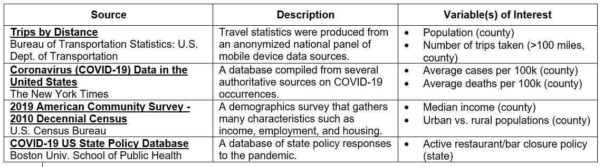

```{r setup, message=FALSE}
install.packages("table1")

#we may not need all of these
library(tidyverse)
library(magrittr)
library(ggplot2)
library(patchwork)
library(sandwich)
library(lmtest)
library(dplyr)
library(table1)
library(ggally)
theme_set(theme_minimal())
knitr::opts_chunk$set(echo = TRUE)

```

## Introduction

Summer vacations in the United States are synonymous with sunny, leisurely days spent with loved ones. As Ella Fitzgerald so aptly sings, “Summertime, and the living is easy.” However, travel in the recent peak-vacation months has certainly deviated from this idealistic frame of mind with the onset of the COVID-19 pandemic in early 2020. The global travel industry has experienced sharp declines. Specifically in the United States, “travel spending totaled a mere $679 billion in 2020, an unprecedented 42% annual decline (nearly $500 billion) from 2019,” according to analysis from the U.S. Travel Association. 
As infection and vaccination rates oscillate regionally along with government policies for business operation restrictions in the United States, our team of data scientists will look to answer the following research question in more detail using linear regression techniques: 

Do COVID infection rates impact vacation travel distance for U.S. residents in the state of Texas? 
How does income, population density, and covid regulations in each county impact traveling? 

We will analyze datasets pertaining to these variables for Texas counties and create three models to understand if causal relationships exist between distance traveled, population income, population density (rural or urban counties), and government regulations. Our hypothesis is that an there is a causal relationship between """

## Operationalization

To create our dataframe, we cleaned and filtered data from multiple sources of data and joined based on texas county name or code. 

#### Operationalization of focus variables
We gathered covid case and death data from NYT. We gathered trip distance data from the Bureau of Transportation, which they record based on data gathered from personal mobile devices. This data was presented as number of travelers in binned distances. We defined a short trip as less than 100 miles and long trips as greater than 100 miles. This was decided under the assumption that distances traveled of less than 100 miles are for the purpose of commuting, while greater than 100 miles indicated vacation travel. Hand in hand with this variable is our indicator variable for urban vs rural setting *** how did we decide this again, population threshold?**** under the assumption that those who live in rural settings are likely to commute further than those in an urban setting. Finally, we believe that median household income plays a significant role in an individual's ability to take vacations. We pulled this directly from the US Census Bureau. 

#### Operationalization of additional variables
To enrich our model and limit OVB, we brainstormed a number of additional variables that could affect travel rates during covid. For one, we looked at how covid affected the county, through the unemployment rate. We also looked at age, gender, income demographics. Then, in addition to income demographics, we focused on percent of younger folks, as defined as those younger than 17 and older folks as defined as those older than 65 because of the nature of how covid affects an individual.


### Variables

For our analysis, we will use datasets and variables from the four following sources:

[](https://ibb.co/zQ3yj2K)

As indicated, each source will provide information on county population demographics such as income, rural vs. urban classification, and status of pandemic regulations. Together, these sources were filtered for the state of Texas and combined to create a dataframe for analysis.

```{r dataframe, echo=FALSE}
df <- read.csv('/home/jovyan/r_bridge/code/lab-2-lab2_section8_jal/data/interim/covid_trips_interim_model3.csv')
head(df)

```


### Accounting Tables

To demonstrate the operationalization of the data, Tables 1 and 2 below display the original value counts from the dataset as well as how many values were removed as a part of filtering the dataset to remove all states except Texas. For the analysis, ### responses were analyzed as shown in Table 1. Table 2 depicts the county type breakdown for rural or urban classification as well. 

```{r Accounting Table creation & output}

step_num = c(1,2,3)

number_of_samples = c(nrow(df),
                      nrow(#newdf1),
                      nrow(#newdf2))                      
samples_removed = c(0,
                    nrow(df)-nrow(#newdf1),
                    nrow(#newdf1)-nrow(#newdf2))
                    
reasoning = c("Original Dataset",
              "Removing XYZ",
              "Removing 123")

accounting_df <- data.frame(step_num,
                            number_of_samples,
                            samples_removed,
                            reasoning)

# knitr::kable(accounting_df)
colnames(accounting_df) <- c('Step','Number of Samples','Samples Removed', 'Reason')
knitr::kable(accounting_df, caption="Accounting Table", align = "c")

# final_depRep_tab_df = dplyr::count(Q2_df, DemorRep, sort = TRUE)
# colnames(final_depRep_tab_df) <- c('Voter Party', 'Number of Samples')
# knitr::kable(final_depRep_tab_df, caption="Final Samples by Party", align = "c")
```


#### Additional Changes to the Data:

Upon final review of the dataset, there are no additional changes required to prepare the dataset for data exploration and subsequent model creation. Outliers or incorrect data are not observed upon final inspection. The Accounting Tables capture the changes made through cleaning and filtering as indicated previously.

## Exploratory Data Analysis


```{r EDA}
#Example Table
table1::label(df$total_pop) <- "TX County Population"
table1::label(df$sum_cases) <- "TX County Covid-19 Cases"

table1::table1(~total_pop + sum_cases | state, data = df)


#Short vs long trip: rate of short trips is higher than rate of long trips in relation to # of covid cases
ggplot(data = df) + aes(x = log(sum_cases), y = log(long_trip)) + geom_point()

ggplot(data = df) + aes(x = log(sum_cases), y = log(short_trip)) + geom_point()

df %>% 
  mutate(
    total_pop = log(total_pop),
    cases = log(cases+1),
    deaths = log(deaths+1),
    long_trip = log(long_trip),
    density = log(density)
  ) %>%
  select(long_trip, cases, deaths, median_income, unempoy_rate, density, pct_lt17) %>% 
  GGally::ggpairs(.,
               legend = 1,
               mapping = ggplot2::aes(colour=as.factor(df$is_rural)))
  

```

Upon transformation of the data based on the figures above, we can see that poupulation size...

## A Model Building Process

## Linear Regression Results

```{r model creation}

#need to change these to per capita data
model1 <- lm(log(long_trip+1) ~ log(cases+1) + log(deaths+1) + is_rural + median_income, data = df) #limited model
model2 <- lm(log(long_trip+1) ~ log(cases+1) + log(deaths+1) + is_rural + median_income + unempoy_rate + log(density), data = df)
model3 <- lm(log(long_trip+1) ~ log(cases+1) + log(deaths+1) + is_rural + median_income + unempoy_rate + log(density) + pct_lt17, data = df) #final model

#Run F test to show statistical significance of additional variables
anova(model1, model2, test = "F")
anova(model2, model3, test = "F")

#Run coeftest to show statistical significance of all variables in the model
coeftest(model3, vcov = vcovHC(model3, type="HC1"))
```

## Discussion
###Model Limitations

```{r CLM assumptions check}

#run this to display the CLM graphs needed to verify CLM assumptions met
par(mfrow = c(2, 2))
plot(model2)

##FINAL MODEL
par(mfrow = c(2, 2))
plot(model3)

```

###Omitted Variable 

<!-- If the team has taken up an explanatory (i.e. causal) question to evaluate, then identify what you think are the most important omitted variables that bias results you care about. For each variable you name, you should reason about the direction of bias caused by omitting this variable. If you can argue whether the bias is large or small, that is even better. State whether you have any variables available that may proxy (even imperfectly) for the omitted variable. Pay particular attention to whether each omitted variable bias is towards zero or away from zero. You will use this information to judge whether the effects you find are likely to be real, or whether they might be entirely an artifact of omitted variable bias. -->

#### Variable 1

One example of an omitted variable that may cause bias in our model is that of vehicle ownership among the population. It can certainly be expected that individuals that own a vehicle would be able to more easily travel short or long distances more frequently with relative ease. If an individual owned a vehicle, this would influence our model by driving the bias further from zero. From the data available, there would no immediate proxy for this omitted variable.

#### Variable 2

Another example of an omitted variable that may also cause bias in our model is fuel prices. Whether this is jet fuel or gasoline, fluctuations in this commodity would certainly impact travel costs. If fuel prices increase, it is generally observed that costs for travel increase. The opposite is also generally true. In the instance of increased fuel prices, this would influence our model by driving the bias closer to zero as distance traveled would drop. Conversely, if fuel prices for the time period of the sample for the population were lower, the bias would would be farther from zero.

## Conclusion & Next Steps

Based upon the linear regression analysis above, it is observed that there may be a causal relationship between XX and YY. The hypothesis posed within the introduction is 'failed to be rejected/ rejected.' ....

For future analysis, it is recommended that Covid-19 policy adherence data per county be incorporated into the model to increase the accuracy. While the Govenor of Texas issued detailed protocols or mandates for the state of Texas, the degree to which each county (and thus the individual residents) complied would be useful data to have if such data were to exist.

## References

